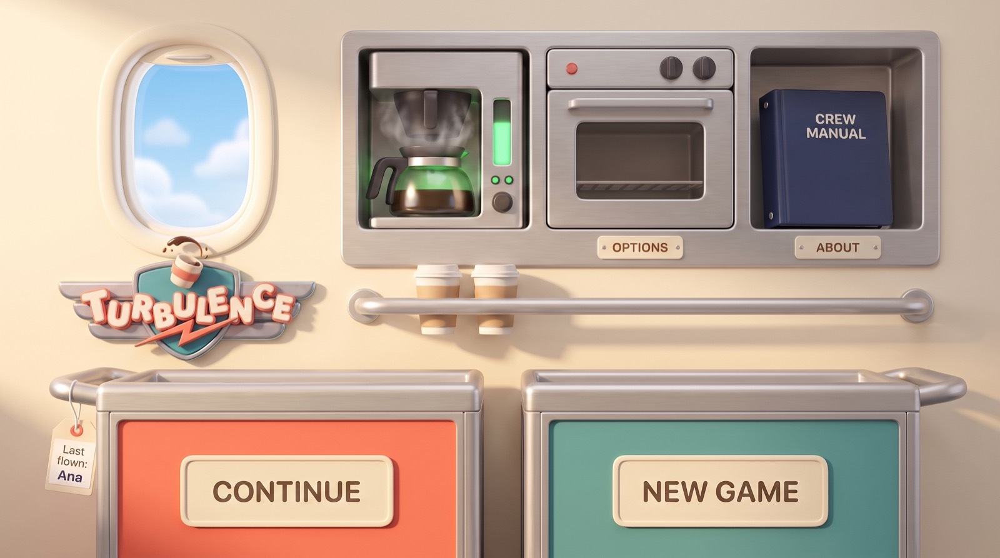

# Galley Main Menu — Spec

2026-10-08 · Marcelo Queiroz · Live doc: [Galley Main Menu — Spec](https://claude.ai/code/artifact/b4bb787d-7cdc-47d5-8da4-25971f2aee11)

## Overview

The main menu becomes the Comet's galley wall. Every menu option is a fitting you tap, and the loose things in the galley react to turbulence. It replaces the logo-and-capsule-buttons menu on the landing page (GDD §9a). The title card before it (cabin flying in through the clouds) stays.

*Target look (Gemini mockup). In the game the labels and the name tag are live text, and the window shows the moving cloud layers.*

**Why a galley:** it is the place the game is played, so the first screen already teaches the setting. It also reuses painted Comet galley art, and turns the existing "bump every few seconds" into something you can watch.

**In scope:** the landing menu's look, its move in from the title card, the turbulence motion and the art it needs.

**Not in scope:** what the menu does (Continue, New Game, Options and About behave exactly as today, so `AppModel` does not change); the Options, About, picker and new-crew cards; the studio splash; the route map.

## Layout

Four fittings are buttons. Everything else is set dressing and must not look tappable.

| Fitting | Where | Action | At rest | Pressed |
| --- | --- | --- | --- | --- |
| Coral service cart | Bottom left | Continue (`app.continueGame`) | Label plate "CONTINUE", tag "Last flown: &lt;name&gt;" | Top drawer slides out ~0.25 s, then the picker opens |
| Teal service cart | Bottom right | New Game (`app.newGame`) | Label plate "NEW GAME" | Drawer slides out, then the new-crew (or replace) card opens |
| Oven | Upper bank, middle | Options (`sheet = .options`) | Door shut, placard "OPTIONS" | Door swings open, then Options opens |
| Crew manual | Upper bank, right cubby | About (`sheet = .about`) | Binder upright, placard "ABOUT" | Binder tips forward, then About opens |
| Coffee maker | Upper bank, left | None (decoration) | Ready light glowing, steam wisps | — |
| Window | Top left | None | Shows the moving cloud layers | — |
| Logo | Under the window | None | `LogoMenu`, mounted like an emblem | — |
| Cups and rail | Middle | None | Two paper cups on the rail | — |

**No crew yet:** the Continue cart's bay stays empty (brakes and floor visible), and the New Game cart takes the coral livery so the main action is always coral. That matches today's rule in `LandingMenu`.

**Screen sizes:** landscape only. Fittings are placed as fractions of a 4:3 safe area centred on the wall, so iPad shows the whole set and wide iPhones show extra wall at the sides. The smallest target is iPhone SE (667 × 375 pt), the largest a 12.9″ iPad. Nothing interactive sits under the notch or the home indicator.

## Flow

The title card plays as today, then the camera goes in through the cabin door to the galley in about 0.8 s.

1. **Title card (unchanged):** the cabin flies in through the clouds, the logo lands. A tap skips it, as now.
2. **Push in (~0.8 s):** the cabin scales up toward its door and fades. The galley wall fades in behind it. The logo shrinks and settles onto its spot under the window. The clouds keep drifting and end up framed by the window.
3. **Galley idle:** the menu is live. The coffee steam and light loop, and a bump comes every 5–9 s (see Turbulence on the galley).
4. **Tap a fitting:** its pressed motion plays (~0.25 s), with a light haptic, then the card opens over the galley as today.
5. **Card open:** the galley stays drawn behind the dimmed card. No bumps while a card is open (same rule as today).
6. **Card closed:** the fitting closes again (drawer in, door shut, binder upright).

Launching straight onto the landing page (a return from the map, or a debug launch) skips steps 1–2 and shows the galley at once.

## Turbulence on the galley

The room holds still and the loose things move. Each bump (every 5–9 s, as today) gives each moving item a kick of random strength, and each item settles back in its own way.

**How it moves:** every moving item has a small damped spring: a value (angle or offset), a speed, a stiffness and a damping. A bump adds speed, and the spring runs on the menu's existing `TimelineView`. Two bumps close together add up, so the motion never looks like a fixed animation. All amounts below are starting values to tune on device.

| Item | Moves as | On a bump | Between bumps | Settles in |
| --- | --- | --- | --- | --- |
| Coffee in the pot | Surface tilt + wave, clipped to the pot | Tilts against the jolt up to ~12°, sloshes back and forth; an extra puff of steam | Slow ripple, ~1° | 1.5–2 s |
| Crew manual | Slide + tip about its bottom corner | Slides up to ~6 pt sideways, tips up to ~8°, can lean on the cubby wall, drops back | Still | ~1 s |
| "Last flown" tag | Pendulum from its string hole | Swings up to ~20°, the biggest motion on screen | Tiny drift, ~2°, like air from a vent | 2–3 s |
| Carts | Rock on the wheels + small slide | Up to ~1.5° and ~4 pt, the two carts slightly out of step; label plates and tag move with them | Still (brakes on) | ~0.6 s |
| Cups on the rail | Hop + rattle | ~3 pt hop | Still | ~0.4 s |
| Coffee ready light | Flicker | Two quick dips in brightness | Steady glow | ~0.3 s |

**Coffee liquid** is drawn in code: a `Canvas` path with a wavy top edge, clipped to the inside of the glass pot. The glass, its highlights and the steam stay painted.

**Taps during a bump:** a fitting's tap area moves with it, so a tap mid-bump still lands. A pressed fitting ignores bumps until it is closed again.

**Screen shake:** cut to about 30% of today's `Jolt` so the room reads as solid. The crew's Screen Shake option still scales the whole effect, item motion included; at 0 nothing moves.

**Haptics:** unchanged, one medium impact per bump when haptics are on.

## Accessibility

The galley must work as well as today's four buttons for anyone who can't see it or doesn't want motion.

- **VoiceOver:** only the four fittings are elements, read in the order Continue, New Game, Options, About. Labels: "Continue, last flown: Ana", "New Game", "Options", "About", each with the button trait. Everything else is hidden from VoiceOver.
- **Tap areas:** at least 44 × 44 pt on the smallest screen, even where the picture is smaller.
- **Reduce Motion:** no push-in (a plain cross-fade instead), no item motion, no screen shake, still clouds. Pressed states still change (drawer out, door open) but without the slide.
- **Text:** labels are live SwiftUI text on blank plates, in the menu's rounded font. They scale with the screen like today's menu, not with Dynamic Type, so they always fit their plates; VoiceOver users get the full label regardless.
- **Contrast:** label text on the cream plates meets 4.5:1.

## Art list

The galley is a painted wall plus separate see-through layers for everything that moves or changes. Under each moving layer the wall is painted empty, so nothing shows a hole when it moves.

| Layer | States | Notes |
| --- | --- | --- |
| Galley wall | One | Wide (about 2.2:1) with the 4:3 safe area in the middle. Transparent window cutout. Empty cubby, empty cart bays, blank placard plates painted in |
| Coffee maker | Ready, plus a separate ready-light glow | Glass pot painted empty; liquid drawn in code |
| Coffee steam | 3 to 4 wisp frames | Loops; extra puff on a bump |
| Oven | Door shut, door open | Placard is part of the wall |
| Crew manual | Upright | Tip and slide done in code |
| Service cart | Drawer shut, drawer out | Painted once in a neutral livery; coral and teal by tint. Blank label plate |
| Name tag | One | Hangs from its string hole (the pivot) |
| Paper cups | One | Two copies on the rail |

**Pipeline:** Gemini (`gemini-3-pro-image`) with the approved mockup and the Comet galley sprites as references, on a flat magenta background for cut-out. Drafts stay in the scratchpad; finals go to `branding/menu/` and into a new `MenuGalley.spriteatlas` via `ios/tools/sprite_atlas.py`. `LogoMenu` and the `TitleCloud` layers are reused as they are.

**Size:** the wall at 2x for the 12.9″ iPad: the 4:3 safe area at 2732 × 2048 px, the whole wall about 4500 px wide. Fittings at the size they show on that iPad.

## Implementation

This is a view-only change: `AppModel` and the cards are untouched, and the work lands in four phases, each ending in a checkpoint.

| File | Change |
| --- | --- |
| `UI/GalleyLayout.swift` (new) | Pure table of fittings: asset, rectangle as fractions of the safe area, role. Maps onto a screen size. No SwiftUI, so it can be unit-tested |
| `UI/GalleyMenu.swift` (new) | `GalleyMenu` view, `GalleyFitting` button style (pressed state, ~0.25 s delay, then the action, accessibility label) |
| `UI/GalleySway.swift` (new) | The damped spring per item, the kick on a bump, the coffee liquid `Canvas` |
| `UI/Landing.swift` | `TitleView` keeps the title card; adds the push-in; clips the clouds to the window; reduces `Jolt`; removes `LandingMenu` and `MenuButton` (used nowhere else) |
| `Assets.xcassets/MenuGalley.spriteatlas` (new) | The art layers |

1. **Phase 0, doc:** write this into GDD §9a. *Checkpoint: GDD updated.*
2. **Phase 1, motion prototype:** cut rough layers out of the mockup by hand and build `GalleyLayout`, `GalleyMenu` and `GalleySway` on them. *Checkpoint: you try the feel in the simulator and we tune the spring numbers.*
3. **Phase 2, final art:** generate the wall and layers in the Art list, build the atlas, swap them in. *Checkpoint: you approve the art.*
4. **Phase 3, polish:** push-in from the title card, Reduce Motion, VoiceOver, every screen size, then tests and screenshots. *Checkpoint: acceptance criteria below all pass.*

Code comments cite `GDD §9a` as elsewhere.

## Testing and acceptance

The menu is done when every box below is ticked on an iPhone SE, an iPhone 17 Pro and a 12.9″ iPad.

**Automated**

- [ ] New `GalleyLayoutTests`: on 667 × 375 and 1366 × 1024 pt, the four tap areas don't overlap, are each at least 44 × 44 pt, and sit inside the safe area
- [ ] New spring tests: a kicked spring returns within 0.5° / 0.5 pt of rest inside its settle time; two kicks close together never exceed 1.5× the item's limit
- [ ] `AppModelTests` pass unchanged
- [ ] Full test suite and a simulator build pass

**On device**

- [ ] Each fitting opens the right card; Continue is hidden with no crew and New Game turns coral
- [ ] Tapping a cart mid-bump opens its card
- [ ] Coffee, manual, tag, carts and cups all move on a bump and settle; no bumps under an open card
- [ ] Screen Shake at 0 and Reduce Motion each stop all motion
- [ ] VoiceOver reads exactly four buttons in order with the right labels
- [ ] No layer shows a hole or a seam when it moves
- [ ] Screenshots of no crew, one crew and a card open, saved for the App Store plan

## Open questions

- [ ] Fittings: keep the mockup's generic oven and coffee maker, or use the game's own copper-dome oven and coffee machine from the Comet set?
- [ ] Should tapping the coffee maker pour a cup as a small hidden treat, or stay pure decoration?
- [ ] Should the cards (Options, About, picker) get a galley frame later, or stay as they are?
- [ ] Should a hard bump ever tip a cup off the rail (it resets when the menu reappears), or is that too busy?
- [ ] Is a separate galley for each aircraft wanted later, or one Comet galley for good?
